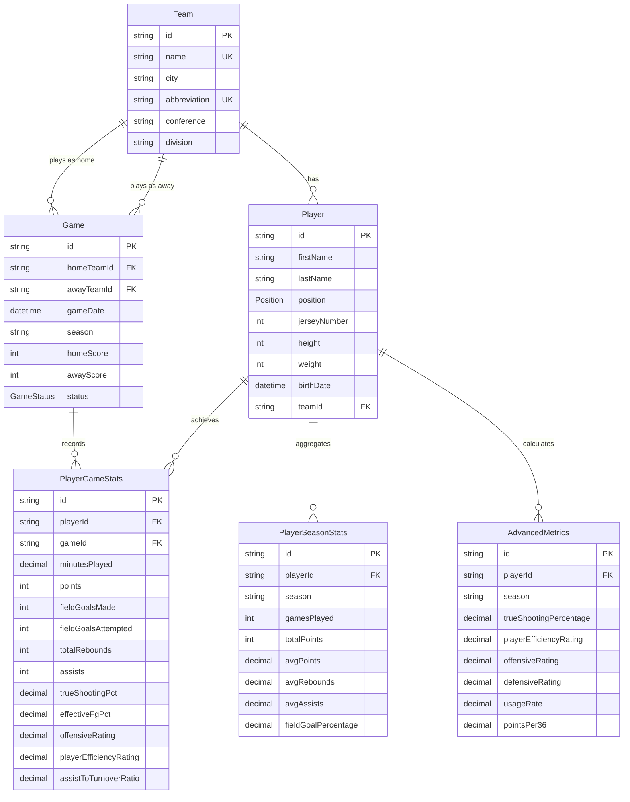

# Basketball Database Schema Documentation

## Overview

This database schema is designed for a comprehensive basketball statistics platform using PostgreSQL and Prisma ORM. It supports player tracking, game statistics, season aggregates, and advanced metrics calculations at both per-game and per-season levels.

## Entity Relationship Diagram



## Core Entities

### Team
Represents a basketball team with organizational details.

**Key Fields:**
- `abbreviation` - Unique 3-letter code (e.g., "LAL", "GSW")
- `conference` / `division` - Organizational structure

**Indexes:**
- Composite index on `(conference, division)` for conference standings

**Relationships:**
- One-to-Many with `Player`
- One-to-Many with `Game` (as home team)
- One-to-Many with `Game` (as away team)

---

### Player
Represents a basketball player with biographical and team information.

**Key Fields:**
- `position` - Prisma enum: `PG`, `SG`, `SF`, `PF`, `C`
- `height` / `weight` - Physical measurements (cm/kg)
- `teamId` - Current team (nullable for free agents)

**Indexes:**
- `teamId` - Fast team roster queries
- Composite `(lastName, firstName)` - Player search

**Relationships:**
- Many-to-One with `Team`
- One-to-Many with `PlayerGameStats`
- One-to-Many with `PlayerSeasonStats`
- One-to-Many with `AdvancedMetrics`

---

### Game
Represents a single game between two teams.

**Key Fields:**
- `homeTeamId` / `awayTeamId` - Competing teams
- `homeScore` / `awayScore` - Final scores
- `season` - Season string (e.g., "2023-24")
- `status` - Prisma enum: `SCHEDULED`, `IN_PROGRESS`, `COMPLETED`, `POSTPONED`, `CANCELLED`

**Indexes:**
- `gameDate` - Chronological queries
- `season` - Season filtering
- Composite `(homeTeamId, awayTeamId)` - Matchup queries

**Relationships:**
- Many-to-One with `Team` (home)
- Many-to-One with `Team` (away)
- One-to-Many with `PlayerGameStats`

---

### PlayerGameStats
Player statistics for a single game. Includes box score data and auto-calculated advanced metrics.

**Box Score Fields:**
- `minutesPlayed` - Decimal(5,2)
- **Shooting:** `fieldGoalsMade`, `fieldGoalsAttempted`, `threePointersMade`, `threePointersAttempted`, `freeThrowsMade`, `freeThrowsAttempted`
- **Rebounding:** `offensiveRebounds`, `defensiveRebounds`, `totalRebounds`
- **Playmaking:** `assists`, `turnovers`
- **Defense:** `steals`, `blocks`, `personalFouls`
- `plusMinus` - +/- while on court (nullable)

**Per-Game Advanced Metrics (auto-calculated via DB trigger):**
- `trueShootingPct` - Decimal(5,4) - TS%
- `effectiveFgPct` - Decimal(5,4) - eFG%
- `usageRate` - Decimal(5,4) - USG% (requires manual calculation, not auto-triggered)
- `offensiveRating` - Decimal(6,2) - ORtg
- `playerEfficiencyRating` - Decimal(6,2) - Simplified PER
- `assistToTurnoverRatio` - Decimal(4,2) - AST/TO

**Constraints:**
- Unique constraint on `(playerId, gameId)` - One stat line per player per game

**Indexes:**
- `playerId` - Player game log
- `gameId` - All stats for a game

---

### PlayerSeasonStats
Aggregated season statistics for a player.

**Key Fields:**
- `season` - Season string (e.g., "2023-24")
- `gamesPlayed`, `gamesStarted`
- Totals: `totalPoints`, `totalFieldGoalsMade`, `totalRebounds`, `totalAssists`, etc.
- Averages: `avgPoints`, `avgRebounds`, `avgAssists`, `avgMinutes`
- Percentages: `fieldGoalPercentage`, `threePointPercentage`, `freeThrowPercentage`

**Constraints:**
- Unique constraint on `(playerId, season)`

**Indexes:**
- `season` - Season queries

---

### AdvancedMetrics
Season-level advanced metrics for a player, calculated by the TypeScript service.

**Key Fields:**
- `trueShootingPercentage` - Decimal(5,4)
- `effectiveFieldGoalPercentage` - Decimal(5,4)
- `playerEfficiencyRating` - Decimal(6,2)
- `offensiveRating` / `defensiveRating` / `netRating` - Decimal(6,2)
- `usageRate` - Decimal(5,2)
- `assistPercentage` / `turnoverPercentage` - Decimal(5,2)
- Per-36 stats: `pointsPer36`, `reboundsPer36`, `assistsPer36`, `stealsPer36`, `blocksPer36`
- `assistToTurnoverRatio`, `stealPercentage`, `blockPercentage`

**Constraints:**
- Unique constraint on `(playerId, season)`

**Indexes:**
- `season` - Season queries
- `playerEfficiencyRating` - PER leaderboards
- `trueShootingPercentage` - Efficiency leaderboards

## Advanced Metrics

### Auto-Calculated via DB Trigger (Per-Game)

The following metrics are **automatically calculated** via a PostgreSQL `BEFORE INSERT OR UPDATE` trigger on the `PlayerGameStats` table:

1. **True Shooting % (TS%)**
   - Formula: `PTS / (2 * (FGA + 0.44 * FTA))`
   - Measures overall shooting efficiency

2. **Effective Field Goal % (eFG%)**
   - Formula: `(FGM + 0.5 * 3PM) / FGA`
   - Adjusts FG% for 3-pointer value

3. **Offensive Rating (ORtg)**
   - Formula: `(PTS / Possessions) * 100` where Possessions = FGA + 0.44*FTA + TOV
   - Points produced per 100 possessions

4. **Player Efficiency Rating (PER) - Simplified**
   - Formula: `(PTS + REB + AST + STL + BLK - Missed_FG - Missed_FT - TOV) / MP * 100`
   - Per-minute efficiency rating

5. **Assist-to-Turnover Ratio**
   - Formula: `AST / TOV`

### SQL Functions Available

All functions are embedded in the Prisma migration and available for on-demand use:

| Function | Parameters | Returns | Description |
|----------|-----------|---------|-------------|
| `calculate_true_shooting_pct` | points, fga, fta | Decimal(5,4) | TS% |
| `calculate_effective_fg_pct` | fgm, 3pm, fga | Decimal(5,4) | eFG% |
| `calculate_usage_rate` | player_fga/fta/tov/mp, team_fga/fta/tov/mp | Decimal(5,4) | USG% |
| `calculate_simple_per` | points, reb, ast, stl, blk, fgm, fga, ftm, fta, tov, mp | Decimal(6,2) | PER |
| `calculate_offensive_rating` | points, fga, fta, tov | Decimal(6,2) | ORtg |
| `calculate_ast_to_ratio` | assists, turnovers | Decimal(4,2) | AST/TO |
| `update_advanced_metrics` | (none) | void | Batch recalculates all rows |

**Usage Rate note:** USG% requires team-level aggregates (team FGA, FTA, TOV, minutes) that are not available in a row-level trigger, so it must be calculated manually using `calculate_usage_rate()`.

## Example Queries

### 1. Player Season Averages with Advanced Metrics

```sql
SELECT
  p."firstName" || ' ' || p."lastName" as player_name,
  t.name as team,
  COUNT(gs.id) as games_played,
  ROUND(AVG(gs.points), 1) as ppg,
  ROUND(AVG(gs."totalRebounds"), 1) as rpg,
  ROUND(AVG(gs.assists), 1) as apg,
  ROUND(AVG(gs.steals), 1) as spg,
  ROUND(AVG(gs.blocks), 1) as bpg,
  ROUND(AVG(gs."trueShootingPct")::numeric, 3) as ts_pct,
  ROUND(AVG(gs."effectiveFgPct")::numeric, 3) as efg_pct,
  ROUND(AVG(gs."offensiveRating")::numeric, 1) as ortg,
  ROUND(AVG(gs."playerEfficiencyRating")::numeric, 1) as per,
  ROUND(AVG(gs."plusMinus"), 1) as plus_minus
FROM "PlayerGameStats" gs
JOIN "Player" p ON gs."playerId" = p.id
LEFT JOIN "Team" t ON p."teamId" = t.id
JOIN "Game" g ON gs."gameId" = g.id
WHERE g.season = '2023-24'
  AND g.status = 'COMPLETED'
GROUP BY p.id, p."firstName", p."lastName", t.name
HAVING COUNT(gs.id) >= 10
ORDER BY ppg DESC
LIMIT 20;
```

### 2. Game Box Score

```sql
SELECT
  p."firstName" || ' ' || p."lastName" as player,
  p."jerseyNumber" as "#",
  p.position as pos,
  gs."minutesPlayed" as min,
  gs.points as pts,
  gs."fieldGoalsMade" || '-' || gs."fieldGoalsAttempted" as fg,
  gs."threePointersMade" || '-' || gs."threePointersAttempted" as "3pt",
  gs."freeThrowsMade" || '-' || gs."freeThrowsAttempted" as ft,
  gs."totalRebounds" as reb,
  gs.assists as ast,
  gs.steals as stl,
  gs.blocks as blk,
  gs.turnovers as tov,
  gs."personalFouls" as pf,
  gs."plusMinus" as "+/-",
  gs."trueShootingPct" as ts,
  gs."effectiveFgPct" as efg
FROM "PlayerGameStats" gs
JOIN "Player" p ON gs."playerId" = p.id
WHERE gs."gameId" = 'game_id_here'
ORDER BY gs.points DESC;
```

### 3. Team Standings

```sql
SELECT
  t.name as team,
  COUNT(CASE WHEN
    (g."homeTeamId" = t.id AND g."homeScore" > g."awayScore") OR
    (g."awayTeamId" = t.id AND g."awayScore" > g."homeScore")
  THEN 1 END) as wins,
  COUNT(CASE WHEN
    (g."homeTeamId" = t.id AND g."homeScore" < g."awayScore") OR
    (g."awayTeamId" = t.id AND g."awayScore" < g."homeScore")
  THEN 1 END) as losses,
  ROUND(
    COUNT(CASE WHEN
      (g."homeTeamId" = t.id AND g."homeScore" > g."awayScore") OR
      (g."awayTeamId" = t.id AND g."awayScore" > g."homeScore")
    THEN 1 END)::numeric / NULLIF(COUNT(g.id), 0),
    3
  ) as win_pct
FROM "Team" t
LEFT JOIN "Game" g ON (g."homeTeamId" = t.id OR g."awayTeamId" = t.id)
  AND g.status = 'COMPLETED'
  AND g.season = '2023-24'
GROUP BY t.id, t.name
ORDER BY win_pct DESC, wins DESC;
```

### 4. Shooting Efficiency Leaderboard

```sql
SELECT
  p."firstName" || ' ' || p."lastName" as player,
  COUNT(gs.id) as games,
  ROUND(AVG(gs.points), 1) as ppg,
  ROUND(AVG(gs."fieldGoalsMade")::numeric / NULLIF(AVG(gs."fieldGoalsAttempted"), 0) * 100, 1) as fg_pct,
  ROUND(AVG(gs."threePointersMade")::numeric / NULLIF(AVG(gs."threePointersAttempted"), 0) * 100, 1) as three_pct,
  ROUND(AVG(gs."trueShootingPct")::numeric * 100, 1) as ts_pct,
  ROUND(AVG(gs."effectiveFgPct")::numeric * 100, 1) as efg_pct
FROM "PlayerGameStats" gs
JOIN "Player" p ON gs."playerId" = p.id
JOIN "Game" g ON gs."gameId" = g.id
WHERE g.season = '2023-24'
  AND g.status = 'COMPLETED'
GROUP BY p.id, p."firstName", p."lastName"
HAVING COUNT(gs.id) >= 10
  AND AVG(gs."fieldGoalsAttempted") >= 5
ORDER BY ts_pct DESC
LIMIT 20;
```

## Performance Optimization

### Indexing Strategy

The schema includes strategic indexes for optimal query performance:

1. **Foreign Key Indexes**: All foreign keys are indexed for fast joins
2. **Composite Indexes**: Multi-column indexes for common query patterns
   - `(conference, division)` on Team - standings queries
   - `(lastName, firstName)` on Player - name searches
   - `(homeTeamId, awayTeamId)` on Game - matchup queries

3. **Leaderboard Indexes**: Single-column indexes on statistical columns in AdvancedMetrics
   - `playerEfficiencyRating` - PER leaderboard
   - `trueShootingPercentage` - Efficiency leaderboard

### Query Optimization Tips

1. **Always filter by season** when querying games to leverage the `season` index
2. **Use the status enum** to filter completed games vs in-progress
3. **Leverage composite indexes** by including all indexed columns in WHERE clauses
4. **Batch calculate metrics** using the `update_advanced_metrics()` function for bulk updates
5. **Use EXPLAIN ANALYZE** to verify index usage in production queries

### Data Types

- **Decimal(5, 4)** for percentages - stores values like 0.5234 (52.34%)
- **Decimal(6, 2)** for ratings - stores values like 110.45
- **Integer** for counts and scores - efficient storage and calculation
- **Text (uuid)** for IDs - globally unique identifiers
- **Timestamp(3)** for timestamps - millisecond precision

## Design Decisions

### Normalization
- **3NF compliance**: Eliminates data redundancy
- **Separate PlayerGameStats table**: Allows efficient querying of player performance per game
- **Separate PlayerSeasonStats / AdvancedMetrics**: Pre-aggregated data for fast season queries

### Two Levels of Advanced Metrics
- **Per-game** (in `PlayerGameStats`): Auto-calculated by DB trigger on every insert/update. Gives instant per-game advanced stats.
- **Per-season** (in `AdvancedMetrics`): Calculated by TypeScript service from aggregated data. Includes metrics that require broader context (DRtg, USG%, per-36 stats).

### Relationships
- **Home/Away Game relations**: Properly models team dynamics via two FK references
- **Cascade deletes**: Deleting a game removes its stats; deleting a player removes their stats and metrics
- **Nullable teamId**: Supports free agent players

### Performance
- **Strategic indexing**: Balances query speed with write performance
- **Automatic metric calculation via trigger**: Reduces application complexity
- **Prisma enums**: Type-safe Position and GameStatus at both DB and application level

---

**Schema Version**: 2.0
**Last Updated**: 2026-02-07
**Prisma Version**: 5.x+
**PostgreSQL Version**: 14+
